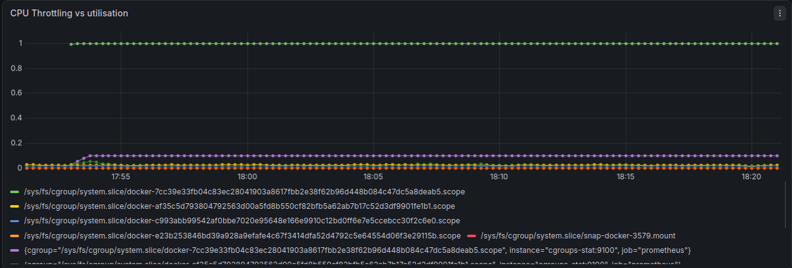
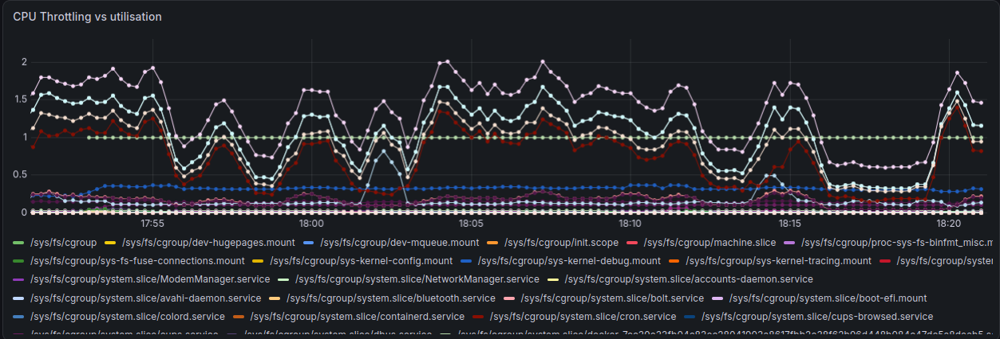
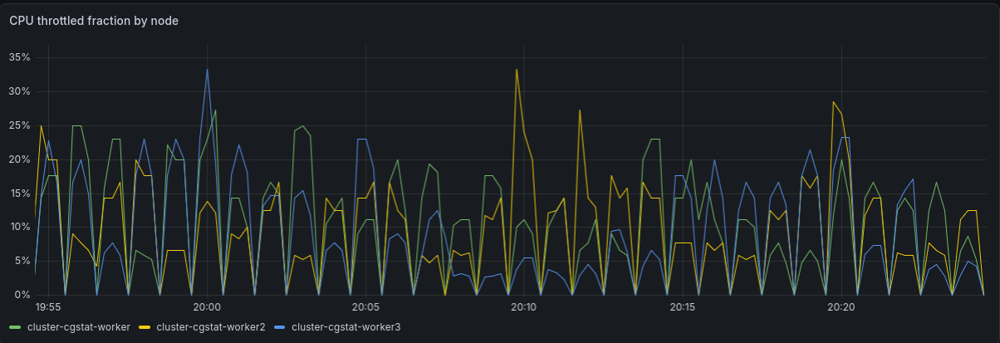

# cgroups-stat

An observability tool for Linux CPU contention. Reads cgroup v2 to surface
throttling — the failure mode standard dashboards miss — and adds an eBPF
runqueue-latency probe to catch the cases cgroup counters structurally cannot see.

## The problem

CPU limits in containers are not a speed governor. The kernel enforces them per *period*: within each 100ms window, a cgroup gets its quota of CPU-time, and once that quota is spent, every task in the group is frozen until the next period begins.

This produces a failure mode that average-utilisation metrics cannot show. Here is a container limited to `--cpus="0.1"` running a busy loop:

```
cpu.max:   10000 100000       # 10ms of CPU per 100ms period
cpu.stat:
  usage_usec      104655167
  nr_periods          10462
  nr_throttled        10462
  throttled_usec  940401669
```

Derived:

| metric | value | meaning |
|---|---|---|
| cores used | 0.0925 | ~9% of one core |
| quota | 0.1 | limit is 10% of one core |
| **throttled fraction** | **0.838** | **84% of wall-clock time frozen** |
| **throttled periods** | **1.000** | **throttled in every period observed** |

A CPU dashboard reports this container at 9% usage against a 10% limit and calls it healthy. In reality it spends 84% of wall-clock time unable to run at all. Any request arriving during a frozen window waits for the next period boundary before it is even scheduled.



*The same container in Grafana: CPU utilisation flat at 0.09 cores while the
throttled fraction sits pinned at 1.0 — every enforcement period hits the
quota ceiling. A utilisation-only dashboard shows the bottom line and nothing else.*

The sanity check: 0.0925 + 0.838 ≈ 0.93. A busy loop is either running or frozen, and those two numbers account for essentially all of its time.

This matters for latency, not throughput. A batch job that gets its work done eventually is unaffected. A service answering requests takes a tail-latency hit on every request unlucky enough to land in a frozen window — and users experience the worst case, not the average.

## What it does

Walks the cgroup v2 hierarchy at `/sys/fs/cgroup`, takes two snapshots one second apart, and computes per-cgroup rates from the deltas.

```
$ cgroups-stat 

CGROUP                                                                                                                                    CORES  QUOTA  THROTTLE%  THR_PERIODS  MEMORY
/                                                                                                                                         0.612  -      0.0%       -            0B
user.slice                                                                                                                                0.317  -      0.0%       -            11.5GiB
user.slice/user-1000.slice/user@1000.service                                                                                              0.316  -      0.0%       -            11.2GiB
user.slice/user-1000.slice                                                                                                                0.315  -      0.0%       -            11.2GiB
system.slice                                                                                                                              0.279  -      0.0%       -            913.7MiB
user.slice/user-1000.slice/user@1000.service/app.slice                                                                                    0.222  -      0.0%       -            9.9GiB
system.slice/x2goserver.service                                                                                                           0.160  -      0.0%       -            31.0MiB
user.slice/user-1000.slice/user@1000.service/app.slice/app-org.gnome.Terminal.slice                                                       0.135  -      0.0%       -            340.0MiB
system.slice/docker-e362b49f191d2b00149f8f893e15f22fcfdd78379a1d9c34761a0de8e983ba1d.scope                                                0.100  0.10   89.9%      1.0          1.5MiB
user.slice/user-1000.slice/user@1000.service/session.slice                                                                                0.093  -      0.0%       -            1.3GiB
user.slice/user-1000.slice/user@1000.service/session.slice/org.gnome.Shell@wayland.service                                                0.090  -      0.0%       -            696.1MiB
user.slice/user-1000.slice/user@1000.service/app.slice/app-org.gnome.Terminal.slice/vte-spawn-3037f9a5-939c-4f09-a8f7-811d33c42375.scope  0.078  -      0.0%       -            150.7MiB
user.slice/user-1000.slice/user@1000.service/app.slice/app-gnome-code-5235.scope                                                          0.065  -      0.0%       -            2.7GiB
user.slice/user-1000.slice/user@1000.service/app.slice/app-org.gnome.Terminal.slice/gnome-terminal-server.service                         0.057  -      0.0%       -            70.3MiB
user.slice/user-1000.slice/user@1000.service/app.slice/snap.firefox.firefox-3dcfaa86-bf58-4d3e-a7c6-4e34dfdb050f.scope                    0.027  -      0.0%       -            6.0GiB
system.slice/neo4j.service                                                                                                                0.011  -      0.0%       -            373.3MiB
system.slice/thermald.service                                                                                                             0.002  -      0.0%       -            4.3MiB
system.slice/containerd.service                                                                                                           0.002  -      0.0%       -            52.1MiB
user.slice/user-1000.slice/user@1000.service/session.slice/org.freedesktop.IBus.session.GNOME.service                                     0.001  -      0.0%       -            17.8MiB
user.slice/user-1000.slice/user@1000.service/session.slice/dbus.service                                                                   0.001  -      0.0%       -            454.5MiB


```

## Install

```bash
go install github.com/SMoatassem/cgroups-stat@latest
```

Linux only, and requires cgroup v2 (unified hierarchy). Check with:

```bash
stat -fc %T /sys/fs/cgroup
# cgroup2fs  -> supported
# tmpfs      -> cgroup v1, not supported
```

## Usage

```
-n int
    Change the number of lines shown in the table (default 20)
-path string
    Modify the starting point of parsing (default "/sys/fs/cgroup")
-prom
    Enable http server for Prometheus exportation
-sort string
    Sort table by: cores | throttle | periods | memory (default "cores")
-tree
    View the cgroup hierarchy as a tree
-v	Enable verbosity to view errors
```


## Metrics

| column | source | meaning |
|---|---|---|
| `cores` | Δ`usage_usec` / Δ wall-clock | CPU-time consumed per second of real time, summed across cores — can legitimately exceed 1.0 |
| `throttle` | Δ`throttled_usec` / Δ wall-clock | fraction of wall-clock time the group spent frozen |
| `periods` | Δ`nr_throttled` / Δ`nr_periods` | fraction of enforcement periods in which throttling occurred |
| `quota` | `cpu.max` quota / period | the configured limit, for reference |
| `memory` | `memory.current` | current charge against the group |

`cores`, `throttle` and `periods` are rates derived from cumulative counters and require two reads. `memory.current` is a gauge and is read directly.

## Prometheus exporter

```bash
cgroups-stat -prom          # serves /metrics on :9101
```

Exposes raw cumulative counters; rates are computed server-side by Prometheus
via `rate()`. This inverts the CLI's approach deliberately — a scrape-time
collector holds no state, so there is no previous snapshot to diff against
and no shared mutable state between the HTTP handler and the collector.

| metric | type |
|---|---|
| `cgstat_cpu_usage_seconds_total` | counter |
| `cgstat_cpu_throttled_seconds_total` | counter |
| `cgstat_cpu_throttled_periods_total` | counter |
| `cgstat_cpu_periods_total` | counter |
| `cgstat_memory_usage_current_bytes` | gauge |



*Every cgroup on the host, scraped live. Container IDs appear directly in the
cgroup path, so each container restart creates a new series — the cardinality
trade-off of using paths as labels.*

A `docker-compose.yml` brings up the exporter, Prometheus and Grafana together.
The exporter requires `cgroup: host` — Docker's cgroup namespace otherwise
rewrites the container's own cgroup as the root of the hierarchy, so the
exporter sees only itself.

## Runqueue latency (eBPF)

Cgroup counters are sampled aggregates. They tell you *that* something
happened, not *when*, *how long each time*, or *who was waiting*. One class of
problem falls through entirely: a container whose throttled fraction is zero
but whose tail latency is terrible.

The cause is contention rather than quota. The pod is not hitting its own
limit — it is waiting behind other tasks for a CPU. Nothing in `cpu.stat`
records that wait, because from the cgroup's point of view nothing happened.

`cgroups-stat` attaches three eBPF programs to measure it directly:

| program | hook | role |
|---|---|---|
| `add_to_map` | `tp_btf/sched_wakeup` | stamp the time a task became runnable |
| `add_to_map_new` | `tp_btf/sched_wakeup_new` | same, for newly forked tasks |
| `fill_hist` | `tp_btf/sched_switch` | on schedule-in, compute the wait and bucket it |

The wait is aggregated **in the kernel** into a log2 histogram keyed by
`{cgroup_id, bucket}`.

`tp_btf` rather than classic tracepoints, because classic tracepoints expose
only flattened scalar fields — no `task_struct`, so no route to the cgroup.

```
runqueue_latency_seconds_bucket{cgroup="/system.slice/nginx.service",le="5e-07"} 216386
runqueue_latency_seconds_sum{cgroup="/system.slice/nginx.service"} 0.412
runqueue_latency_seconds_count{cgroup="/system.slice/nginx.service"} 267000
```

Both layers label series with the same cgroup path, so the two can be joined
in a single query.


### Validation

The histogram's total wait time was compared against
`node_schedstat_waiting_seconds_total`, the kernel's own per-CPU runqueue
accounting from `/proc/schedstat`, exported by `node_exporter`:

```promql
sum(rate(runqueue_latency_seconds_sum[5m]))         # 0.0338
sum(rate(node_schedstat_waiting_seconds_total[5m])) # 0.0341
```

Two entirely independent measurement paths — one maintained by the scheduler,
one built here — agreeing within about 1% on an idle host.

### Requirements

The eBPF layer needs more than the cgroup reader:

- Linux 5.5+ with BTF at `/sys/kernel/btf/vmlinux`
- `CAP_BPF` and `CAP_PERFMON` — not full `privileged` 

Building from source additionally needs `clang`, `llvm` and `libbpf-dev`, since
the generated bindings are not committed:

```bash
sudo apt-get install -y clang llvm libbpf-dev
go generate ./...
go build ./...
```

`vmlinux.h` *is* committed. CO-RE resolves field offsets at load time from the
running kernel's BTF, so the header only has to satisfy the compiler — the
kernel it was dumped from need not match the kernel that runs the probe.

## Kubernetes

Manifests in `k8s/` deploy the exporter as a DaemonSet — one pod per node —
alongside Prometheus and Grafana, with pod-based service discovery so targets
are found automatically as nodes come and go.

```bash
kind create cluster --config multi-node.yaml
kubectl apply -f k8s/
kubectl get pods # to get the name of the pod
kubectl port-forward pod/grafana-XXX 3000:3000
```

The Grafana dashboard is in `k8s/grafana-dashboard.json`.



*Throttled fraction per node on a three-node cluster.*


## Design notes

**Snapshots and derived values are separate types.** `cgroup.Record` holds what was read from the filesystem; `rate.Sample` holds what was computed from two Records. Keeping them apart means `ComputeRates` is a pure function of its inputs — it can be unit-tested with hand-written structs and no filesystem at all, which is where the throttling arithmetic is actually verified.

**Counter resets are detected and reported as unknown, not as zero.** If any counter moves backwards between snapshots, the cgroup was destroyed and recreated at the same path. The delta is meaningless, so the sample is marked as having no rate and the table prints `-`. Printing `0.000` would be indistinguishable from an idle container.

